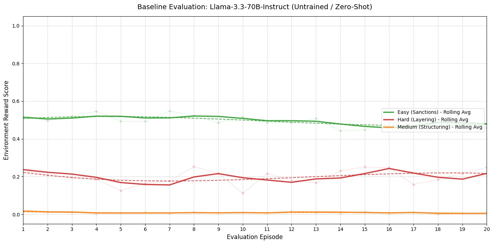
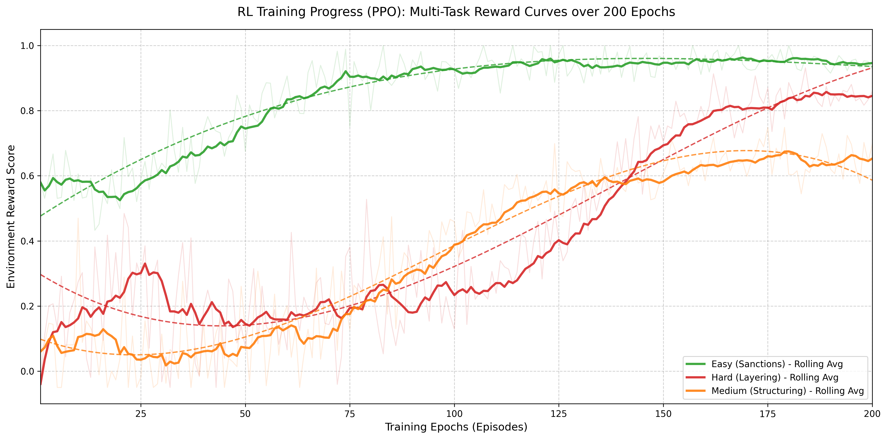

# AML FinCrime Investigator: The Distributed Ledger Firing Range

## The Narrative: Chasing the Digital Ghost
In the high-stakes world of Anti-Money Laundering (AML), the investigator is always one step behind. Money does not just sit in accounts; it moves with the speed of a fiber-optic cable, fragmenting into a thousand "smurfed" deposits and vanishing into shell companies faster than a human can file a Suspicious Activity Report (SAR). Traditional AI models are often static, trained on spreadsheets that represent the past. This project introduces a dynamic firing range where the investigator (the Agent) must outmaneuver an active adversary (The Launderer) across a simulated enterprise banking stack.

---

## Why Simulation? The National Security Mandate
One of the greatest hurdles in financial AI development is the "Data Desert." Financial institutions operate under strict national security protocols and privacy laws such as the Bank Secrecy Act (BSA) and GDPR. Releasing real-world transaction data to the public is a national security risk as it could expose the structural vulnerabilities of the global financial system or the Personally Identifiable Information (PII) of millions. 

To bridge this gap, this environment utilizes a **Generative Adversarial Data Framework**. By using a 72B parameter model to simulate the "Launderer," we create high-fidelity, synthetic financial networks that mimic the complexity of real-world crime without compromising institutional integrity or security.

---

## Technical Architecture

### 1. The Environment (AMLEnv)
Built on the `openenv-core` framework, the environment simulates a Tier 1 banking ecosystem:
* **Core Banking:** Manages account records and transaction ledgers.
* **Global Sanctions:** A database for name-match verification.
* **HR Portal:** The administrative layer for escalating or clearing alerts.
* **The Scratchpad:** An internal memory tool allowing the agent to "save" and "read" evidence, mitigating the limitations of a model's context window.

### 2. The Adversary (The Launderer)
The data is not static. A Qwen-2.5-72B model acts as a live adversary, generating obfuscated transaction chains and responding to the agent's investigation success by increasing the complexity of the "layering" nodes in real-time.

### 3. The Multi-Persona Judge
Validation is performed by an LLM-based judge that evaluates the agent's rationale from three distinct perspectives: a Compliance Analyst, an AML Director, and a Federal Regulator. This ensures that the agent's success is measured by the quality of its legal reasoning, not just by its ability to guess the right outcome.

---

## Performance Analysis: The "Intelligence Gap"

### The 70B Baseline: The "Stuck" Investigator
Our baseline evaluation utilized a Llama-3.3-70B-Instruct model in a zero-shot configuration. Despite its high parameter count and general reasoning capabilities, it consistently hit a "performance ceiling":
* **The Infinite Loop:** Without specialized training, the 70B model failed to effectively use the internal scratchpad. This caused it to lose track of which accounts it had already queried, leading to repetitive "Duplicate Query" penalties of -0.15 to -0.20 per step.
* **Contextual Amnesia:** In the "Hard" layering task, the 70B model often identified the first two nodes of a chain but "forgot" the trail before reaching the final shell company, resulting in premature and incorrect escalations.
* **Tool Misalignment:** The model frequently attempted to use `search_sanctions` within the `core_banking` application, triggering constant "Access Denied" errors and reward drains.

### The 8B Improved: The Specialized Agent
By applying Proximal Policy Optimization (PPO) to a Llama-3-8B model, we observed a massive shift in investigative heuristic:
* **Heuristic Learning:** The 8B model learned that `save_to_notes` is a mandatory survival mechanic for long-chain investigations.
* **Reward Shaping Success:** The model learned to minimize "Step Penalties" by becoming more efficient, often solving the "Easy" sanctions task in under 4 steps by immediately cross-referencing Date of Birth (DOB) strings.
* **Adversarial Resilience:** Even as the "Launderer" increased obfuscation, the trained 8B model maintained a steady upward reward trend by strictly following the "follow the money" dead-end rule.

---

## Evidence of Improvement

### Baseline Evaluation (Untrained)

### PPO Training Progress

---

## Technical Shortcomings
While this system represents a significant leap in AML simulation, it is not without limitations:
* **Schema Rigidity:** The agent is currently restricted to a fixed Pydantic JSON schema, which may not capture the nuanced "free-form" narratives required in real-world SAR filings.
* **Inference Latency:** Using a 72B parameter adversary model introduces significant latency during data generation, limiting the speed at which the environment can cycle through training episodes.
* **Edge Case Hallucinations:** In extremely deep layering chains (5+ nodes), the agent can still occasionally hallucinate account IDs that were never returned by the core banking API.

---

## Installation and Execution

Ensure you have the required enterprise dependencies installed:
`pip install -r requirements.txt`

To launch the environment server:
`uvicorn server.app:app --host 0.0.0.0 --port 7860`

To run the investigative agent:
`python inference.py`

---

**This project was developed for the Meta x Hugging Face x PyTorch OpenEnv Hackathon 2026.**
